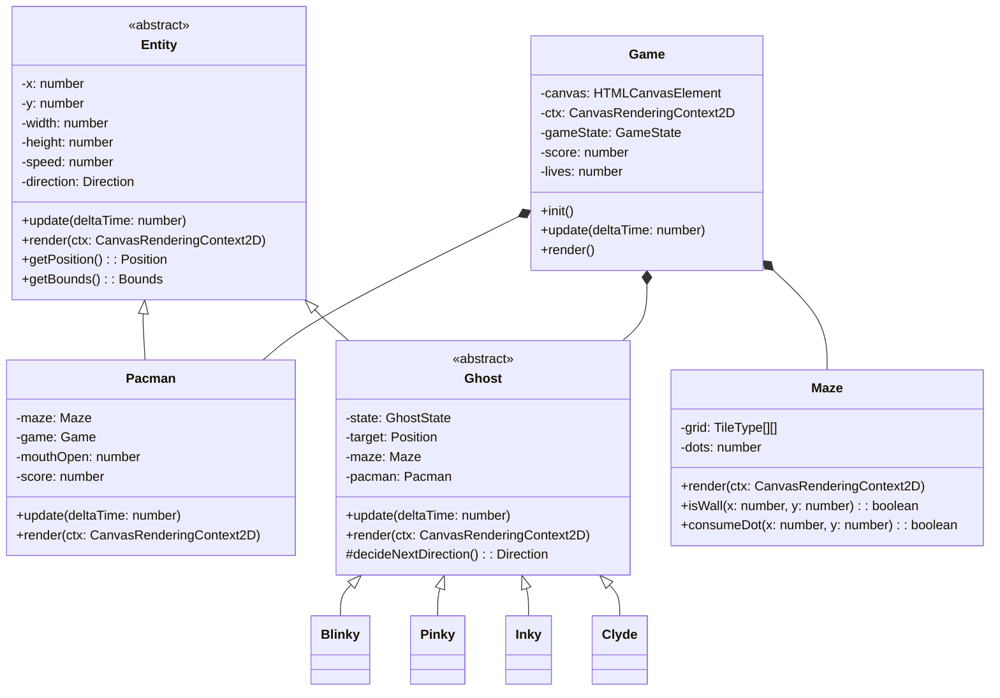
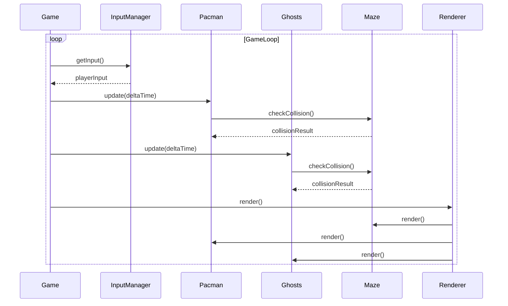

# Architecture du Jeu Pac-Man

## Vue d'Ensemble

Le jeu Pac-Man est construit selon une architecture orientée objet, avec une séparation claire des responsabilités entre les différents composants. Cette documentation détaille l'architecture technique et les interactions entre les différents modules.

## Diagrammes UML

### Diagramme de Classes

### Diagramme de Séquence - Boucle de Jeu

## Architecture des Composants

### 1. Core Components

#### Game (src/core/Game.ts)

- Gère la boucle de jeu principale
- Coordonne les interactions entre les entités
- Gère les états du jeu (menu, en cours, pause, game over)

#### InputManager (src/managers/InputManager.ts)

- Singleton gérant les entrées utilisateur
- Mappe les touches aux actions du jeu
- Gère la file d'attente des entrées pour des contrôles fluides

#### SoundManager (src/managers/SoundManager.ts)

- Gère tous les effets sonores et la musique
- Optimise le chargement et la lecture des sons
- Contrôle les volumes et les priorités audio

### 2. Entities

#### Entity (src/entities/Entity.ts)

- Classe de base abstraite pour tous les objets du jeu
- Gère position, vitesse et collision de base
- Définit l'interface commune pour update() et render()

#### Pacman (src/entities/Pacman.ts)

- Gère le mouvement et l'animation du joueur
- Détecte les collisions avec les pac-gommes et les fantômes
- Maintient le score et l'état du power-up

#### Ghost (src/entities/Ghost.ts)

- Implémente les comportements de base des fantômes
- Gère les états (chase, scatter, frightened)
- Fournit les méthodes communes pour le pathfinding

### 3. World

#### Maze (src/entities/Maze.ts)

- Représente la grille du labyrinthe
- Gère les collisions et les pac-gommes
- Optimise le rendu du labyrinthe

## Patterns de Conception Utilisés

1. **Singleton**

   - Utilisé pour InputManager et SoundManager
   - Garantit une instance unique pour la gestion globale

2. **State**

   - Implémenté pour les états du jeu et des fantômes
   - Permet des transitions fluides entre les états

3. **Observer**

   - Utilisé pour les événements du jeu
   - Découple les composants pour une meilleure maintenabilité

4. **Factory**
   - Employé pour la création des fantômes
   - Facilite l'extension avec de nouveaux types de fantômes

## Optimisations

1. **Rendu**

   - Double buffering pour éviter le scintillement
   - Batch rendering pour les éléments statiques
   - Optimisation des sprites et animations

2. **Performance**

   - Pool d'objets pour les particules et effets
   - Mise en cache des calculs de pathfinding
   - Optimisation des collisions avec quadtree

3. **Mémoire**
   - Gestion efficace des ressources audio
   - Nettoyage automatique des objets inutilisés
   - Limitation des allocations pendant le gameplay

## Tests et Qualité

1. **Tests Unitaires**

   - Couverture > 80% du code
   - Tests des comportements critiques
   - Mocks pour Canvas et Audio

2. **Tests d'Intégration**
   - Validation des interactions entre composants
   - Tests de performance
   - Tests de compatibilité navigateur

## Déploiement

1. **Web**

   - Build optimisé avec Webpack
   - Compression des assets
   - Cache-control optimisé

2. **Desktop**
   - Packaging avec Electron
   - Auto-updates
   - Configurations spécifiques par OS
